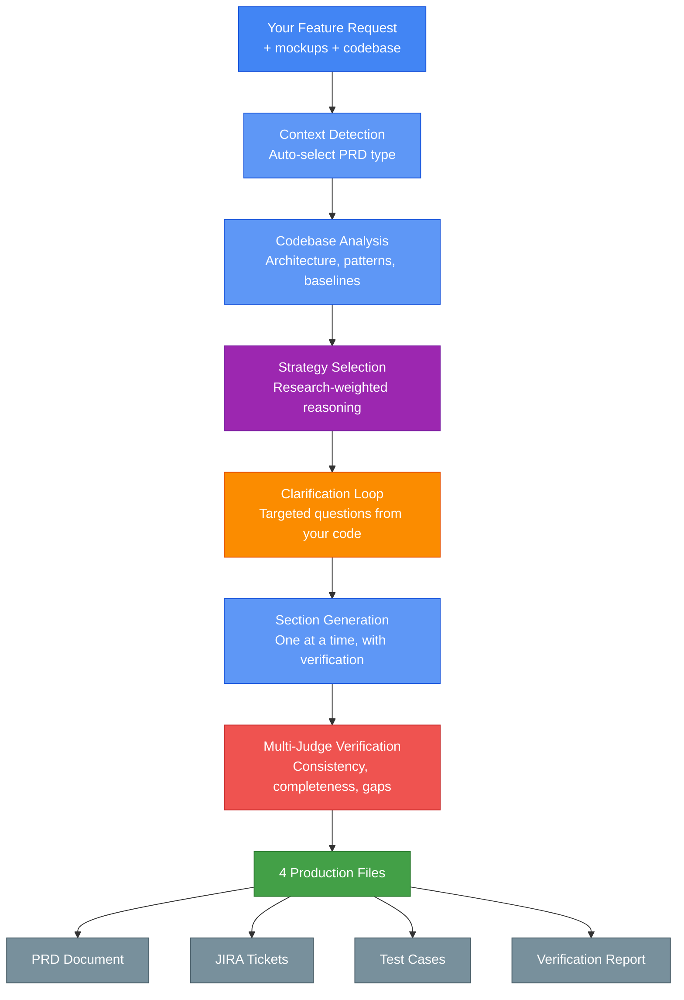
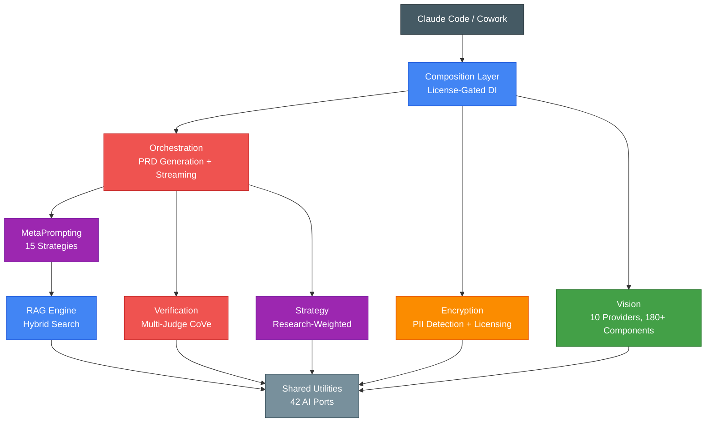

<p align="center">
  
</p>

<h1 align="center">AI Architect PRD Generator</h1>

<p align="center">
  <strong>Turn feature requests into production-ready specs in minutes, not days.</strong>
</p>

<p align="center">
  <a href="CHANGELOG.md"></a>
  <a href="LICENSE"></a>
  <a href="#pricing"></a>
  <a href="#install-on-cowork"></a>
  <a href="https://swift.org"></a>
</p>

<p align="center">
  <a href="#install-on-cowork">Cowork Plugin</a> &middot;
  <a href="#install-as-claude-code-plugin">Claude Code Plugin</a> &middot;
  <a href="#pricing">Pricing</a> &middot;
  <a href="#how-it-works">How It Works</a> &middot;
  <a href="SKILL.md">Full Docs</a>
</p>

---

AI Architect PRD Generator is a plugin for **Claude Code** and **Cowork** that produces implementation-ready PRDs with SQL DDL, domain models, API specs, JIRA tickets, and test cases — all verified by multi-LLM consensus before delivery.

Describe what you want to build. Get back a complete PRD with sprint-ready tickets.

---

## The Problem

Writing PRDs manually takes **4-8 hours** per document. Generic AI tools produce vague, untestable requirements that need heavy rework. Teams waste sprint cycles going back and forth on incomplete specs.

## The Solution

AI Architect PRD Generator combines **8 specialized AI engines** to produce PRDs that are ready for implementation — not just high-level descriptions, but concrete specifications with:

- Exact SQL DDL with constraints, indexes, and RLS policies
- Domain models with validation rules and error types
- REST API specs with rate limits and auth requirements
- Fibonacci-pointed JIRA tickets with task breakdowns
- Testable acceptance criteria linked to business KPIs
- Multi-LLM verification ensuring internal consistency

---

## Installation

Three ways to install, depending on your workflow.

### Install on Cowork

The fastest path. Works in Anthropic's cloud environment with zero local setup.

```bash
# From the Cowork marketplace
claude plugin install ai-prd-generator
```

The plugin bundles its own MCP server (Node.js, zero dependencies). No Swift toolchain required. License validation works in both cloud and local modes.

### Install as Claude Code Plugin

For local Claude Code with full engine access and hardware-bound licensing.

```bash
# Clone and install
git clone https://github.com/cdeust/ai-prd-generator.git
cd ai-prd-generator
./scripts/setup-plugin.sh
make install-plugin
```

Restart Claude Code. The plugin loads automatically with 7 MCP tools.

### Install as a Skill

Lightweight option — no MCP server, just the SKILL.md workflow.

```bash
mkdir -p ~/.claude/skills
git clone https://github.com/cdeust/ai-prd-generator.git ~/.claude/skills/ai-prd-generator
cd ~/.claude/skills/ai-prd-generator && ./scripts/setup.sh
export ANTHROPIC_API_KEY="sk-ant-..."
```

---

## How It Works

<p align="center">
  
</p>

The system asks targeted questions informed by your codebase and mockups before writing a single line. Scope assessment, epic selection, and multi-round clarification — all interactive.



1. **Detect** — Identifies the PRD type (feature, bug, release, MVP...) and adapts section depth automatically
2. **Analyze** — Indexes your codebase to extract architecture patterns, baselines, and existing models
3. **Select** — Picks optimal reasoning strategies from 15 options based on claim complexity
4. **Clarify** — Asks targeted questions informed by your actual code, not generic templates
5. **Generate** — Produces each section with research-backed strategies, one at a time so you can refine
6. **Verify** — Multi-judge consensus catches contradictions, orphan requirements, and specification gaps
7. **Deliver** — Exports 4 files: PRD, JIRA tickets, test cases, and a full verification audit trail

---

## What You Get

<p align="center">
  
</p>

Every PRD generation produces **4 files**:

### 1. PRD Document (`PRD-{Name}.md`)

Full implementation spec with:
- Overview, goals with measurable baselines and targets
- Functional and non-functional requirements (numbered, prioritized)
- User stories with GIVEN-WHEN-THEN acceptance criteria
- SQL DDL (tables, indexes, RLS, materialized views)
- Domain models with validation and error types
- REST API specification with rate limits
- Implementation roadmap with story points per phase

### 2. JIRA Tickets (`PRD-{Name}-jira.md`)

Sprint-ready backlog:
- Epics with story breakdowns
- Fibonacci story points (no ticket > 13 SP)
- Task-level breakdowns per story
- Dependencies mapped
- CSV export for direct JIRA import

### 3. Test Cases (`PRD-{Name}-tests.md`)

QA-ready test suite:
- Unit, integration, and E2E test cases
- Each acceptance criterion mapped to specific tests
- Full traceability matrix (no orphan ACs)
- Test data requirements

### 4. Verification Report (`PRD-{Name}-verification.md`)

Audit trail:
- Section-by-section quality scores
- Every claim verified with algorithm + strategy used
- Assumption and risk log with owners
- Completeness check (all items logged)

---

## Verification

<p align="center">
  
</p>

Every claim in every PRD is verified using 6 verification algorithms and 15 reasoning strategies. The verification report includes baselines, deltas, and measurement methods — not just pass/fail.

| Algorithm | What It Does |
|-----------|-------------|
| **KS Adaptive Consensus** | Stops early when judges agree, saving 30-50% LLM calls |
| **Zero-LLM Graph** | Finds orphan requirements and circular dependencies for free |
| **Multi-Agent Debate** | Resolves disputed claims through structured argumentation |
| **Complexity-Aware Routing** | Right-sizes verification depth to claim complexity |
| **Atomic Decomposition** | Splits vague claims into independently verifiable atoms |
| **Unified Pipeline** | Orchestrates all algorithms with automatic routing |

---

## 8 PRD Types, Adaptive Depth

Every PRD type has its own section template, question depth, and retrieval strategy. The system adapts automatically based on what you're building.

| Type | Best For | Depth |
|------|----------|-------|
| **Feature** | New functionality with full technical specs | Deep |
| **Bug** | Root cause analysis with regression prevention | Focused |
| **Proposal** | Business cases and stakeholder pitches | High-level |
| **MVP** | Fastest path to market, explicit cut list | Balanced |
| **Release** | Migration plans, rollback strategies, go/no-go | Comprehensive |
| **Incident** | Post-mortem forensics, prevention measures | Exhaustive |
| **POC** | Feasibility validation, risk assessment | Lightweight |
| **CI/CD** | Pipeline automation, deployment strategies | Technical |

---

## Architecture

Built on 8 specialized engine packages with clean separation of concerns.



**75+ AI/ML technologies** across 8 packages and ~1,490 Swift files.

### AI Provider Support

Works with the AI providers you already use:

| Provider | Models | Highlights |
|----------|--------|------------|
| **Anthropic** | Claude 4.5 / 4.6 | Extended Thinking, Prompt Caching |
| **OpenAI** | GPT-5 / 5.2 | Reasoning Effort, JSON Mode |
| **Google** | Gemini 3.0 Pro | 2M context, Thinking Level |
| **AWS Bedrock** | Claude / Nova / Llama | Multi-region, enterprise |
| **OpenRouter** | 100+ models | Unified API, cost optimization |
| **Apple Intelligence** | On-device 3B | 100% private, zero-cost inference |

Plus 4 Chinese vision providers (DeepSeek, Qwen, Zhipu, MiniMax) for mockup analysis.

---

## Usage

In Claude Code or Cowork, just describe what you want:

```
Generate a PRD for a real-time notification system with
push notifications, in-app alerts, and email digests.
```

The system will:
1. Detect this as a **feature** PRD
2. Ask 8-10 targeted clarification questions
3. Generate sections one by one (you can refine each)
4. Export 4 files to your working directory

### More Examples

**With codebase analysis:**
```
Generate a FEATURE PRD for adding user authentication.
Codebase: /path/to/my-project
```

**With a GitHub repo:**
```
Generate a PRD for adding OAuth to this project:
https://github.com/myorg/my-app
```

**From a mockup:**
```
Generate a PRD for this design: [attach screenshot]
```

**Bug investigation:**
```
Generate a BUG PRD for: checkout fails silently when
cart has more than 50 items
```

---

## Pricing

Start free. Upgrade when you need the full engine.

| | **Free** | **Licensed** |
|---|---|---|
| **Price** | $0 | **$79/month** or **$499 lifetime** |
| **PRD Types** | Feature, Bug | All 8 types |
| **Thinking Strategies** | 2 (Zero-Shot, CoT) | All 15 research-backed strategies |
| **Verification** | Basic single-pass | Multi-judge consensus pipeline |
| **Codebase Analysis** | Basic keyword search | Hybrid search with re-ranking |
| **Clarification Rounds** | 3 max | Unlimited |
| **Vision (Mockup Analysis)** | -- | 10 providers, 180+ components |
| **Strategy Engine** | Basic selection | Research-weighted enforcement |
| **Business KPIs** | Summary | Full 8 metric systems |
| **Trial** | -- | **14 days free**, no credit card |

**Free tier works immediately** — no license key, no account, no setup.

**14-day free trial** of the full licensed tier — try everything before committing.

<p align="center">
  
  <br/>
  <em>Free tier running in Cowork — license validated via MCP</em>
</p>

<p align="center">
  <a href="https://ai-architect.tools/purchase"><strong>Get Licensed &rarr;</strong></a>
</p>

---

## Privacy & Security

- **100% local execution** — All processing runs on your machine
- **No telemetry** — Zero analytics, zero tracking, zero phone-home
- **Your code stays yours** — Codebase analysis uses local embeddings only
- **API keys in env vars** — Never logged, never stored, never transmitted
- **Hardware-bound licenses** — Cryptographically tied to your machine
- **Encrypted distribution** — Engine packages use AES-256-GCM encryption

---

## Requirements

| Requirement | Details |
|-------------|---------|
| **OS** | macOS 14+ (macOS 26+ for Apple Intelligence vision) |
| **Runtime** | Node.js 18+ (for MCP server), Swift 6.2+ (for engine) |
| **AI Provider** | At least one API key (Anthropic recommended) |
| **Cowork** | Works out of the box, no local requirements |
| **Optional** | Docker/Colima for RAG indexing, GitHub CLI for repo analysis |

---

## Documentation

| Resource | Description |
|----------|-------------|
| [SKILL.md](SKILL.md) | Full workflow documentation and configuration |
| [CHANGELOG.md](CHANGELOG.md) | Version history and release notes |
| [LICENSE](LICENSE) | Commercial license terms |
| [LEGAL.md](LEGAL.md) | IP ownership and cryptographic proof of origin |
| [examples/](examples/) | Usage examples with sample output |

---

## License

**Commercial Software** — [Full license terms](LICENSE)

Free tier available without a license key. Licensed tier requires a valid, hardware-bound license for full feature access.

For questions: **admin@ai-architect.tools**

---

<p align="center"><strong>Copyright 2026 Clement Deust</strong> — All rights reserved.</p>
